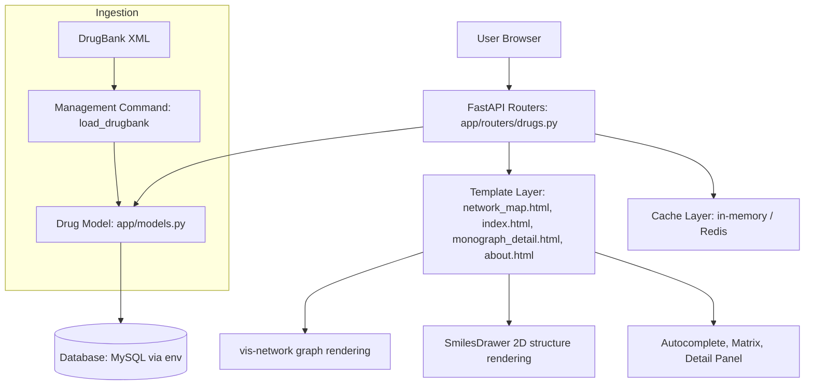

# System Architecture Plan

## Scope
Sistem ini menyediakan beberapa halaman utama:
- `/network-map/` — visualisasi interaksi molekuler antar obat (fitur utama)
- `/drugs/` — Drug Index: pencarian, filter, dan daftar obat
- `/drugs/<drugbank_id>/` — Monograph Detail: detail satu obat
- `/about/` — dokumentasi dan penggunaan
- `/api/drug-autocomplete/` — endpoint API autocomplete

Halaman utama (`/`) melakukan redirect ke `/network-map/`.

## High-Level Architecture

## Runtime Flow

### Drug Index (`/drugs/`)
1. User mencari obat berdasarkan nama, ID, atau CAS.
2. Filter berdasarkan tipe obat.
3. Hasil ditampilkan dalam tabel, dapat klik untuk detail.

### Monograph Detail (`/drugs/<drugbank_id>/`)
1. Menampilkan detail lengkap satu obat: identitas, farmakologi, genomik, struktur, interaksi, dsb.
2. Visualisasi struktur 2D dan relasi menggunakan vis-network dan SmilesDrawer.

### Network Map (`/network-map/`)
1. User memilih hingga 6 obat + filter.
2. View mengumpulkan data dari Drug model (JSON fields: targets, genomics, enzymes, transporters, carriers, interactions, food_interactions).
3. Payload graph dicache dan dikirim ke template.
4. Frontend merender network graph (vis-network), matrix comparison, dan struktur 2D (SmilesDrawer).

## Data Model Notes
Entity utama: `Drug` (drugs/models.py)
- Identitas/meta: `drugbank_id`, `name`, `drug_type`, dsb.
- Data klinis/farmakologi: indication, pharmacodynamics, mechanism_of_action, toxicity, metabolism, absorption, half_life, route_of_elimination, volume_of_distribution, clearance
- Data genomik: field JSON genomics
- Data molekuler/relasional: JSON fields (targets, enzymes, transporters, carriers, interactions, food_interactions)
- Metadata referensi, produk, sekuens
- Raw XML DrugBank disimpan untuk audit/migrasi

## Environment and Deployment Notes
- Environment variable via `.env` (python-dotenv)
- Database: default development SQLite, production MySQL (env: `DB_CONNECTION`, `DB_HOST`, `DB_PORT`, `DB_DATABASE`, `DB_USERNAME`, `DB_PASSWORD`)
- Perintah manajemen:
  - `python manage.py check` (sanity check)
  - `python manage.py load_drugbank <xml_file>` (import data DrugBank)

## Frontend & Integrasi
- vis-network: visualisasi graph interaksi
- SmilesDrawer: visualisasi struktur kimia 2D
- TailwindCSS: styling modern
- Autocomplete API: pencarian cepat
- Matrix comparison, detail panel, dan fitur interaktif lain

## SDG Alignment
Platform ini mendukung:
- **SDG 3 (Good Health and Well-Being)**: keputusan pengobatan lebih aman melalui visualisasi interaksi
- **SDG 9 (Industry, Innovation, and Infrastructure)**: infrastruktur digital clinical decision support
- **SDG 4 (Quality Education)**: eksplorasi edukatif data farmakologi molekuler

## Budget Framework (Indicative)
1. **Infrastructure**: hosting, database, backups, monitoring.
2. **Data Operations**: DrugBank update processing and quality checks.
3. **Engineering**: maintenance, security patching, feature hardening.
4. **Clinical/Domain Review**: validation of interpretation guidance.
5. **Documentation & Training**: user guidance and onboarding materials.

## Funding Strategy (Indicative)
- University/research grants
- Health innovation grants
- Institutional digital transformation programs
- Public-private collaboration for non-commercial educational deployment

## Risks and Controls
- **Risk**: stale interaction data
  - **Control**: periodic DrugBank ingestion schedule + validation logs.
- **Risk**: over-reliance in clinical use
  - **Control**: explicit non-diagnostic warning in UI and About page.
- **Risk**: graph overload/performance
  - **Control**: max-node limit, caching, and selective filters.

## Next Technical Milestones
1. Add ingestion run metadata table (last run, record counts, failures).
2. Add lightweight health endpoint for deployment monitoring.
3. Add focused tests for network map query/filter behavior.
4. Introduce staged environments (dev/staging/prod) with separate DB credentials.

Git:
============
# 1. Cek status file yang berubah (opsional tapi disarankan)
git status

# 2. Tambahkan semua perubahan ke area persiapan (staging)
git add .

# 3. Rekam perubahan dengan pesan yang jelas
git commit -m "Deskripsi singkat apa yang Anda ubah (misal: Update logika CDSS)"

# 4. Ambil update dari server (untuk jaga-jaga jika ada perubahan di GitLab)
git pull origin main

# 5. Kirim perubahan ke GitLab
git push origin main
